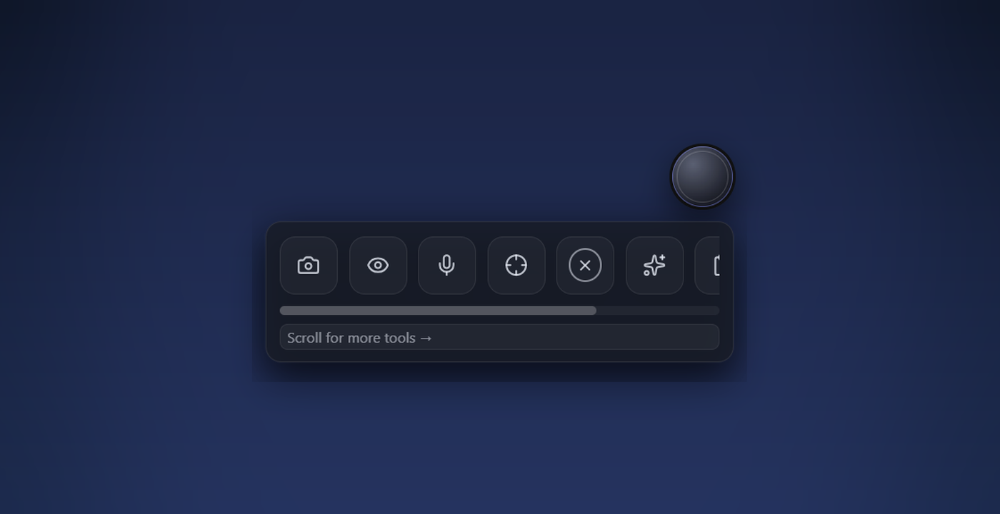
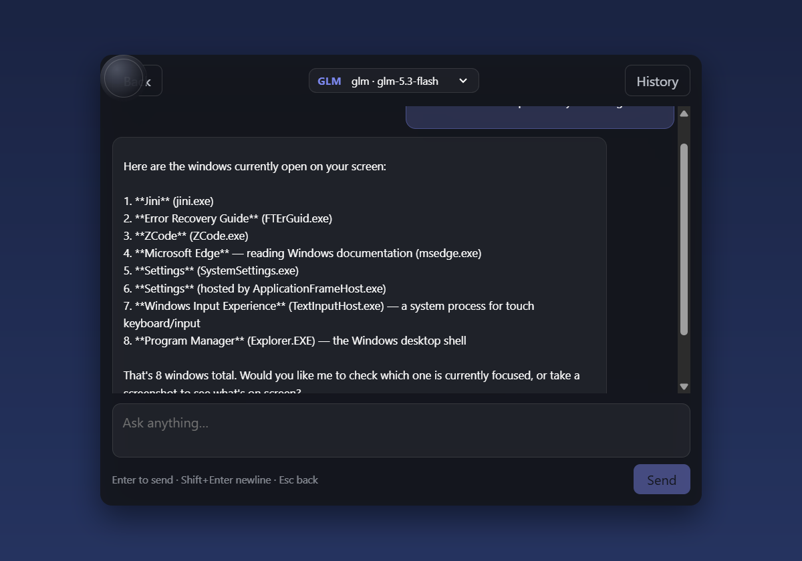
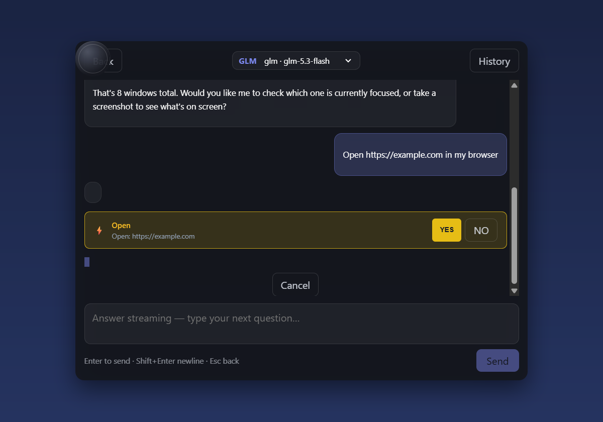

<div align="center">

# Jini

**A floating AI assistant for Windows that sees your screen, talks, and acts — with your own API keys.**

[](https://github.com/Kcoof/jini)
[](https://v2.tauri.app)
[](https://www.rust-lang.org)
[](LICENSE)

</div>

---

Jini lives as a small disc on your desktop. Click it and a tray of tools opens:
look at the screen, capture a region, talk to it by voice, or ask anything.
It streams answers from **your own AI providers**, can call tools while it
thinks (list windows, read the screen, click, type, open apps), and asks
**YES / NO before every action** that touches your computer.



## What it can do

| | |
|---|---|
| 👁 **See** | Capture the full screen or a selected region and ask about it — "what's wrong with this error dialog?" |
| 🗣 **Talk** | Speech-to-text (Windows SpeechRecognizer) and spoken replies via SAPI — dictate with a screenshot attached automatically |
| ✋ **Act** | The agent can click, type, press keys, find UI elements, and open apps — each action gated behind a YES / NO card |
| 🔁 **Agent loop** | Tool calls stream in as cards while the model works; every round-trip is persisted to SQLite history |
| 🔌 **MCP door** | Ships `jini-mcp`, a read-only Model Context Protocol server — connect Jini's eyes to ZCode, Claude Desktop, or any MCP client |
| 🔑 **Your keys** | Works with Z.ai (GLM), MiniMax, OpenAI-compatible endpoints, or a custom base URL. Keys live in Windows Credential Manager, never on disk |



### Every action asks first

When the agent wants to control your computer — open a URL, click, type —
a confirmation card appears. Nothing happens until you press **YES**.
Decline paths, blocked system folders, and a blocklist of dangerous
executables are enforced in Rust before any input is synthesized.



## Getting started

**Prerequisites:** Windows 10/11, [Rust](https://rustup.rs), Node.js 18+, and
a WebView2 runtime (preinstalled on Windows 11).

```bash
git clone https://github.com/Kcoof/jini.git
cd jini
npm install
npm run tauri dev
```

Then:

1. Click the disc → **Settings** → pick a provider and paste your API key
   (it goes straight into Windows Credential Manager).
2. Try **Eyes Check All** — one click sends your whole screen to the model.
3. Turn on **Action tools** in Settings when you want the agent to be able
   to click/type/open things (off by default).

### Connecting an outside AI over MCP

Jini also runs as a read-only MCP stdio server, so an external agent
(ZCode, Claude Desktop, …) can use Jini's eyes:

```json
{
  "mcpServers": {
    "jini": {
      "command": "C:\\src\\jini\\src-tauri\\target\\release\\jini-mcp.exe"
    }
  }
}
```

Six read-only tools are exposed: screen capture, window list, focused window,
UI element inspection, clipboard read, and app list. Actions (click / type /
open) are deliberately **not** exposed over MCP.

## How it's built

- **Tauri v2 + React 18 + TypeScript** for the UI; the overlay window is a
  transparent, always-on-top disc that expands into a tray, a workspace, or a
  full-screen selection overlay.
- **Rust core** — the agent loop is a hand-rolled OpenAI-compatible streaming
  client (SSE, tool-call fragment reassembly, cancel support), input
  synthesis via Win32 `SendInput`, UI automation via UIA, voice via WinRT
  `SpeechRecognizer` and SAPI.
- **SQLite** for conversations and settings; **Windows Credential Manager**
  for keys; screenshots save to `Pictures\Jini`.
- **54 Rust tests** cover the SSE parser, tool-call reassembly, the action
  guard (blocked paths, click bounds), and settings round-trips.

## Project layout

```
src/                 React UI (tray, workspace chat, settings, confirm cards)
src-tauri/src/       Rust core (agent loop, tools, capture, voice, MCP server)
src-tauri/src/bin/   jini-mcp — the MCP stdio server binary
specs/               Phase-by-phase engineering specs (phase-0 … phase-2.6)
docs/                Screenshots
```

## Status

Built phase by phase — each phase has a spec in [`specs/`](specs/) and a
line in [`PROJECT-PLAN.md`](PROJECT-PLAN.md). Voice input needs the Windows
speech capability and the *Online speech recognition* privacy switch.
Wake-word ("Jini …") and more action tools are on the roadmap.

## License

[MIT](LICENSE) © Kcoof
